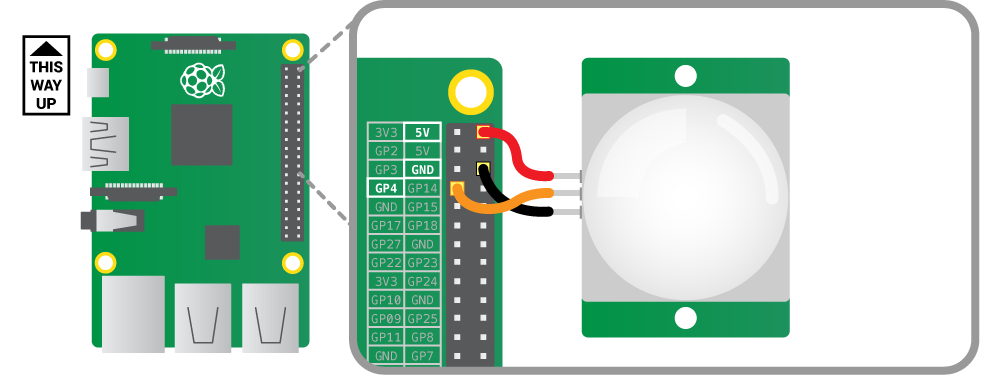
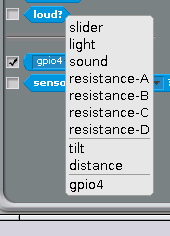

# Santa detector

You will build a detector that spots any movement and sets off an alarm. Along the way, you will learn how to connect a passive infra-red (PIR) sensor to the Raspberry Pi, and how to control the flow of your Scratch program by responding to the input from the sensor. 

## Connect the PIR motion sensor

Before booting your Raspberry Pi, connect the PIR module to the Raspberry Pi.

Using three female-to-female jumper cables, you'll need to connect each of the PIR sensor's connectors to the appropriate pins on the Raspberry Pi.

Connect the top one labelled `VCC` on the PIR sensor to the 5V pin on the Raspberry Pi, connect the middle one labelled `OUT` to GPIO pin 4, and connect the bottom one labelled `GND` to a ground pin also marked `GND`. All shown in the following diagram:

## Test the sensor

Because we are using the GPIO pins, we need to run a special version of Scratch called 'Scratch GPIO 5'. Double-click this icon on the desktop to run it.

Scratch uses the 'Sensing' blocks to check if there is any input on the GPIO pins. If there is an input, the value of the pin changes from `0` to `1`. As you connected the PIR sensor to pin 7 of the Pi, we need to monitor that. 

- Click on the drop-down menu on the `sensor value` block and choose `pin7`.
- Tick the check-box to the left of the block to display the pin value on screen.

Test the PIR sensor by waving your hand in front of it. When it detects movement, the value on the screen should change from `0` to `1`.

If the value doesn't change, check that the correct pins are connected.

## Draw a sprite and add sound

Click on the 'Costumes' tab and draw a Santa sprite. This will be displayed when the PIR senses movement.

Click on the 'Sounds' tab and import a sound from the 'Electronic' folder. I've used a siren called 'Whoop' here.

## Program what happens when the detector spots movement

Now we have a sensor that reports when it is on or off, we can use this value to control the flow of our program.  

Build the following script:

### What is the the program doing?

The `if` statement continuously checks the pin 7 sensor value. When this changes to `1` it does the following:

- shows the sprite
- makes the sprite bigger
- waits a bit
- plays a sound
- makes the sprite normal size

It keeps doing this as long as the sensor value is `1` i.e. when the PIR detects movement.

The `else` statement simply hides the sprite when the sensor value is 0.

## Set up the detector in your room!

- On Christmas Eve, set up your Pi with the sensor pointing at your bedroom door.
- Connect your Pi to a huge speaker.
- Make sure the sensor does not detect you in bed or you will get false positives; the alarm will go off every time you move!
- Go to sleep.
- Wake up when Santa comes in and feed him mince pies and sherry.

**Disclaimer:** we cannot guarantee that this alarm will not scare Santa off so that you get no presents at all, not even a wrinkled satsuma in an old sock.

## What next?

Other stuff to try:

- Make the background flash 
- Animate the sprite using costumes
- Change the sound ('Santa Claus is coming to town' would be good!) 
- Use different graphic effects instead of `change size`
- Display a message 
- Build a support or stand for the PIR module
