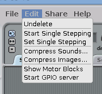

# Weihnachtsmann Detektor 

Du wirst einen Detektor bauen der jede Bewegung detektiert und einen Alarm auslößt. Dabei wirst du lernen wie du einen Bewegungssensor mit dem Raspberry Pi verbindest und wie du dein Scratch Programm darauf reagieren läßt. 

## Verbinde den Motion Sensor

Bevor du den Raspberry Pi hochfährst, verbinden den Sensor mit dem Raspberry Pi. 

Nehme drei female-to-female Jumper Kabel und verbinde sie mit den richtigen Pins deines Pis. 

Verbinde den mit `VCC` gelabelten Pin auf dem Sensor mit dem 5V Pin deines Raspberry Pis, verbinden den mittleren Pin mit  `OUT` gelabelten Pin mit dem GPIO Pin 4, und verbinde den mit `GND` gelabelten mit mit einem GND Pin auf deinem Pi. Hier siehst du noch einmal alles in dem Diagramm.

## Teste den Sensor

Because we are using the GPIO pins, we need to start the GPIO server in Scratch: 

- On the desktop run Scratch using `Menu -> Programming -> Scratch`.
- Once Scratch is running choose `Start GPIO Server` from the `Edit` menu.

Scratch uses the 'Sensing' blocks to check if there is any input on the GPIO pins. If there is an input, the value of the pin changes from `0` to `1`. As you connected the PIR sensor to GPIO pin 4 of the Pi, we need to monitor that. 

Firstly we need to tell Scratch that pin 4 will be used as an input by *config*uring it. 

- Create a broadcast message as follows:

- Double click the broadcast block to run it. You only need to do this once.

- In the `Sensing` block palette click on the drop-down menu on the `sensor value` block and choose `gpio4`.
- Tick the check-box to the left of the block to display the pin value on screen.

**NOTE**: If you do not see  `gpio4` on the list, make sure that the **GPIO server is running** and that you have **run the config broadcast**.

Test the PIR sensor by waving your hand in front of it. When it detects movement, the value on the screen should change from `0` to `1`.

If the value doesn't change, check that the correct pins are connected.

## Draw a sprite and add sound

Click on the 'Costumes' tab and draw a Santa sprite. This will be displayed when the PIR senses movement.

Click on the 'Sounds' tab and import a sound from the 'Electronic' folder. I've used a siren called 'Whoop' here.

## Program what happens when the detector spots movement

Now we have a sensor that reports when it is on or off, we can use this value to control the flow of our program.  

Build the following script:

### What is the the program doing?

The `if` statement continuously checks the pin 7 sensor value. When this changes to `1` it does the following:

- shows the sprite
- makes the sprite bigger
- waits a bit
- plays a sound
- makes the sprite normal size

It keeps doing this as long as the sensor value is `1` i.e. when the PIR detects movement.

The `else` statement simply hides the sprite when the sensor value is 0.

## Set up the detector in your room!

- On Christmas Eve, set up your Pi with the sensor pointing at your bedroom door.
- Connect your Pi to a huge speaker.
- Make sure the sensor does not detect you in bed or you will get false positives; the alarm will go off every time you move!
- Go to sleep.
- Wake up when Santa comes in and feed him mince pies and sherry.

**Disclaimer:** we cannot guarantee that this alarm will not scare Santa off so that you get no presents at all, not even a wrinkled satsuma in an old sock.

## What next?

Other stuff to try:

- Make the background flash 
- Animate the sprite using costumes
- Change the sound ('Santa Claus is coming to town' would be good!) 
- Use different graphic effects instead of `change size`
- Display a message 
- Build a support or stand for the PIR module
